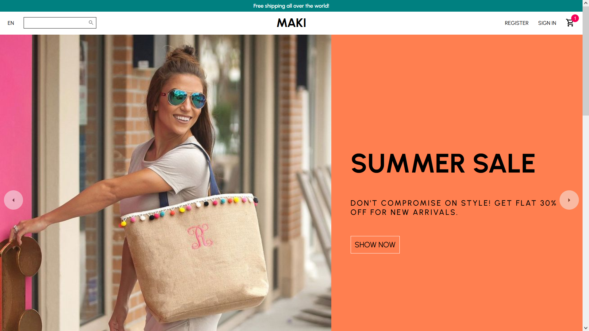
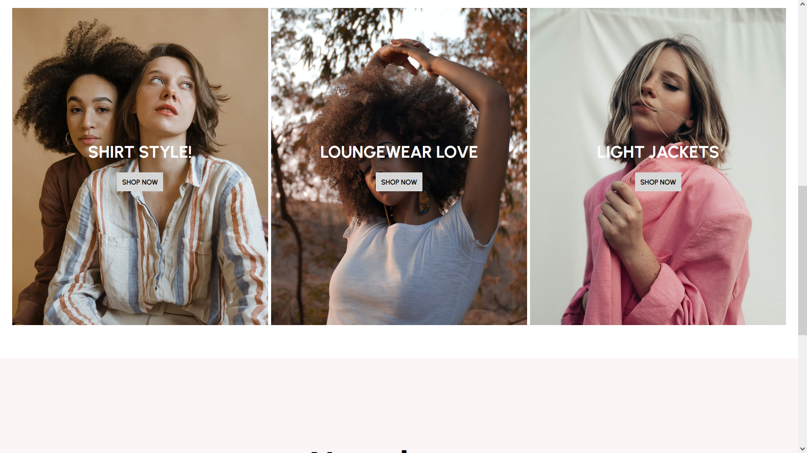
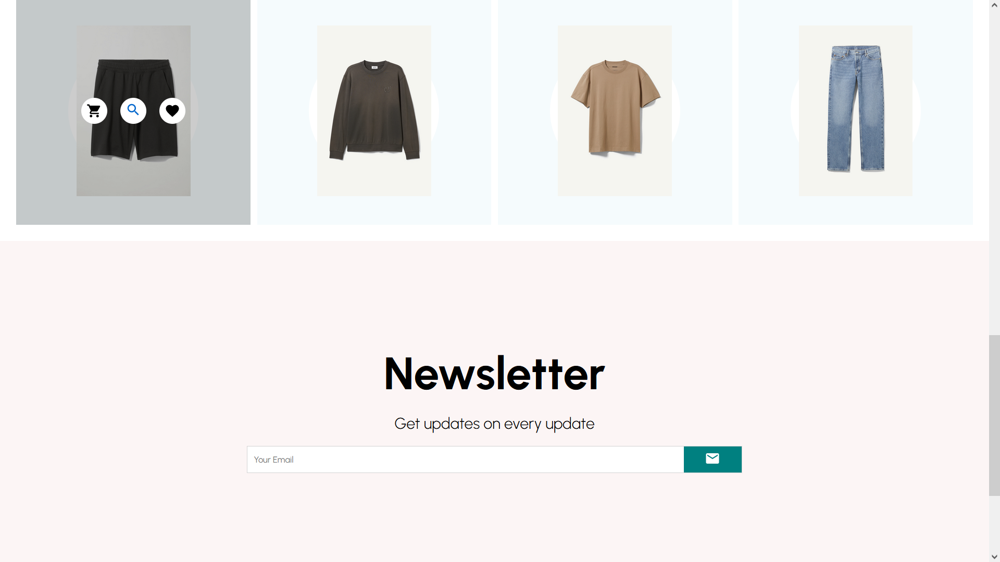
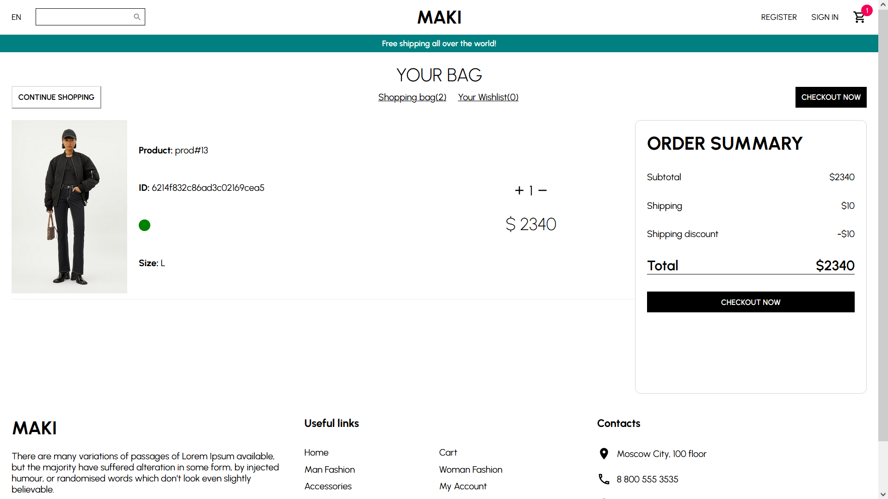
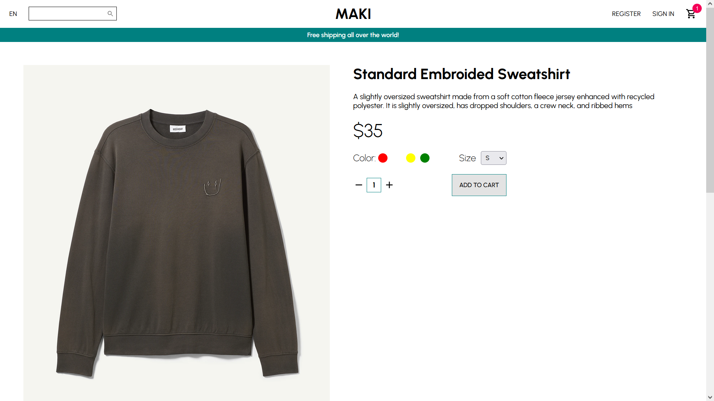
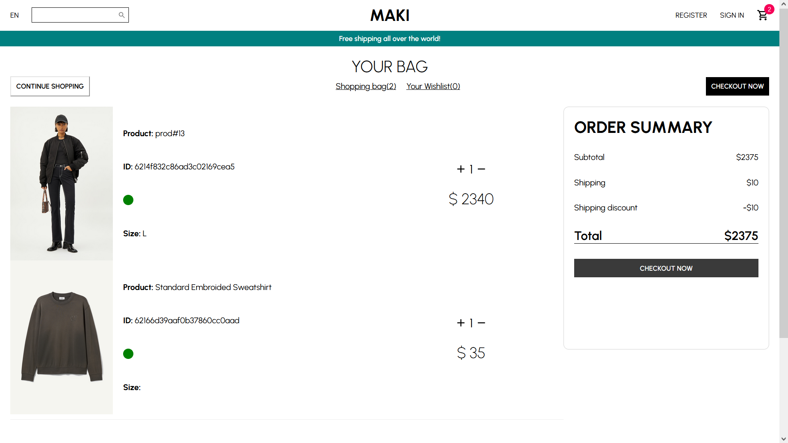

# E-shop maki

## React pet-project(MERN)

Created "Maki" e-shop, using React & Styled Components

- <code>api</code> - all API logic with routers & models.
- <code>api/models</code> - schemas for MongoDB
- <code>public</code> - UI for "maki"
- <code>public/redux</code> - redux components

## Used technologies

- JavaScript
- ReactJS
- Redux
- React Router v6
- NodeJS
- MongoDB
- ExpressJS
- Axios

## Screenshots

 

